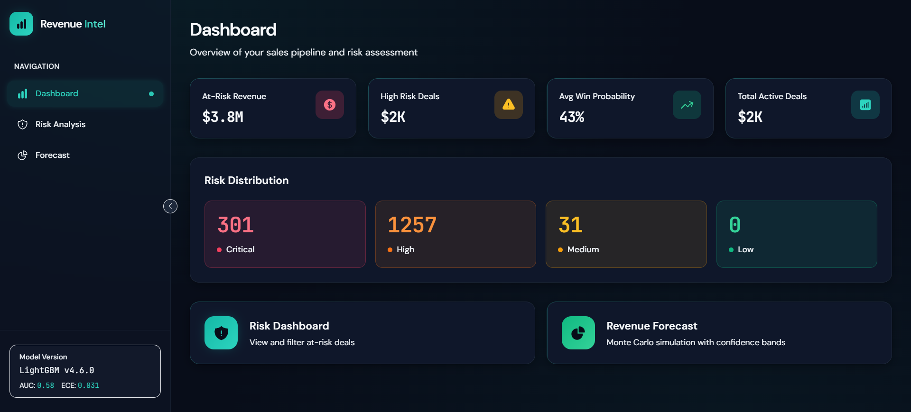
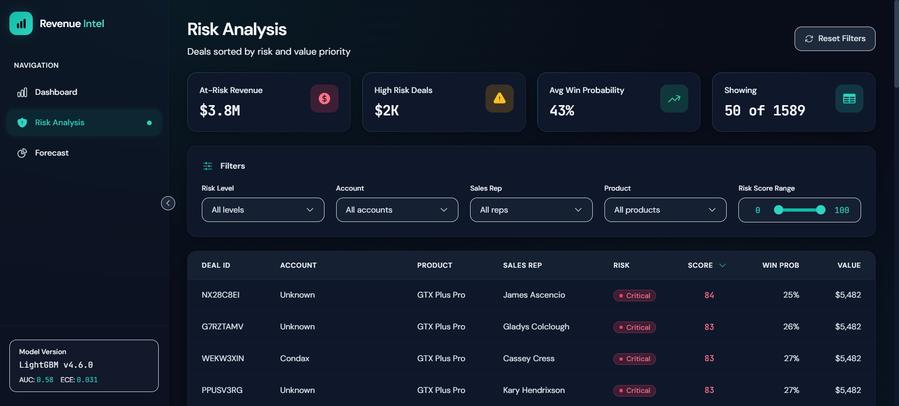
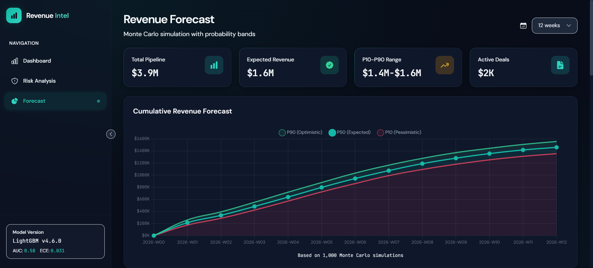

# Revenue Intelligence System

> ML-powered sales pipeline risk analysis and revenue forecasting with explainable predictions

[](https://www.python.org/downloads/)
[](https://fastapi.tiangolo.com/)
[](https://vuejs.org/)
[](https://lightgbm.readthedocs.io/)

---

## Demo

<!-- Replace with actual screenshots -->
| Risk Dashboard | Deal Detail | Revenue Forecast |
|:---:|:---:|:---:|
|  |  |  |
| Filter and prioritize at-risk deals | SHAP-based explanations for each deal | Monte Carlo revenue projections |

**Live Demo:** [Coming Soon] <!-- Replace with deployed URL if available -->

---

## Problem Statement

Sales teams manage thousands of open deals but lack data-driven answers to critical questions:
- Which deals need immediate attention?
- What's the probability this deal closes this quarter?
- Why is this deal flagged as high-risk?

This system provides **explainable ML predictions** to help sales leadership prioritize pipeline work and intervene earlier.

---

## Key Features

- **Risk Scoring** — Composite scoring (0-100) identifying deals likely to slip or lose
- **Win Probability** — Calibrated LightGBM predictions with isotonic regression
- **Revenue Forecasting** — Monte Carlo simulation with P10/P50/P90 confidence intervals
- **SHAP Explanations** — Human-readable explanations for why each deal is at risk
- **Interactive Dashboard** — Filter by account, rep, product, and risk level
- **Sub-50ms API Response** — Precomputed predictions for instant UI

---

## Tech Stack

| Layer | Technologies |
|-------|--------------|
| **Frontend** | Vue 3, TypeScript, TailwindCSS, Chart.js, Vue Query |
| **Backend** | FastAPI, Pydantic, Uvicorn |
| **ML/AI** | LightGBM, SHAP, scikit-learn, Optuna |
| **Infrastructure** | Docker, Docker Compose, Nginx |

---

## How It Works

```
┌──────────────────┐     ┌──────────────────┐     ┌──────────────────┐
│   Training       │     │   Inference      │     │   Serving        │
│                  │     │                  │     │                  │
│  CSV Data        │     │  Feature         │     │  FastAPI         │
│       ↓          │     │  Engineering     │     │       ↓          │
│  Feature Eng.    │────▶│       ↓          │────▶│  Vue 3 Dashboard │
│       ↓          │     │  LightGBM        │     │       ↓          │
│  LightGBM        │     │  Predictions     │     │  Interactive     │
│  + Calibration   │     │       ↓          │     │  Visualizations  │
│       ↓          │     │  Risk Scoring    │     │                  │
│  Model Artifacts │     │  + SHAP          │     │                  │
└──────────────────┘     └──────────────────┘     └──────────────────┘
```

**Data Flow:**
1. **Training**: Historical CRM data → Feature engineering → LightGBM with isotonic calibration
2. **Inference**: Open deals → Win probability + Risk score → Cached predictions
3. **Serving**: API serves cached predictions; SHAP explanations computed on-demand

---

## Installation & Setup

### Prerequisites
- Python 3.12+
- Node.js 18+
- Docker (optional)

### Option 1: Docker (Recommended)

```bash
cd docker
docker-compose up

# Frontend: http://localhost:3000
# API Docs: http://localhost:8000/docs
```

### Option 2: Local Development

```bash
# Backend
python -m venv venv
source venv/bin/activate  # Windows: venv\Scripts\activate
pip install -e ".[api]"

# Generate predictions
python models/inference/predict.py

# Start API
uvicorn api.main:app --reload --port 8000

# Frontend (new terminal)
cd frontend
npm install
npm run dev
```

---

## Project Structure

```
├── api/                  # FastAPI backend
│   ├── routes/           # REST endpoints (deals, forecast, health)
│   ├── schemas/          # Pydantic models
│   └── services/         # SHAP explainer service
├── core/                 # ML & business logic
│   ├── scoring/          # Risk score formula
│   ├── forecasting/      # Monte Carlo engine
│   └── explanations/     # SHAP integration
├── models/               # ML pipeline
│   ├── training/         # LightGBM training
│   ├── inference/        # Batch predictions
│   └── artifacts/        # Saved models
├── frontend/             # Vue 3 SPA
│   ├── src/views/        # Dashboard, Risk, Deal, Forecast
│   └── src/components/   # Reusable UI components
└── docker/               # Container configuration
```

---

## Challenges & Learnings

| Challenge | Solution |
|-----------|----------|
| Low model AUC (0.58) on demo dataset | Focused on calibration over raw accuracy; isotonic regression ensures probabilities are reliable |
| SHAP computation is slow | On-demand calculation + caching; precompute for batch operations |
| Uncertainty in revenue forecasts | Monte Carlo simulation (1000 runs) captures full probability distribution |
| Feature engineering at scale | Time-series splits prevent data leakage; careful feature selection |

**Key Insight:** Decision-support systems prioritize *actionability* over *accuracy*. A well-calibrated 70% probability is more useful than an uncalibrated 85%.

---

## Future Improvements

- [ ] Real CRM integration (Salesforce, HubSpot APIs)
- [ ] PostgreSQL backend for production scale
- [ ] Real-time streaming predictions (Kafka)
- [ ] Slack/email alerts for high-risk deals
- [ ] A/B testing framework for intervention tracking

---

## Author

**SINU** 

- GitHub: [sinu-sinu](https://github.com/sinu-sinu)
- LinkedIn: [sinu-sinu](https://linkedin.com/in/sinu-sinu)
- Email: sinu28.sinu@gmail.com

---

## License

MIT License - See [LICENSE](LICENSE) for details.

---

*Built to demonstrate production ML engineering: end-to-end pipelines, model explainability, calibrated predictions, and clean architecture.*
